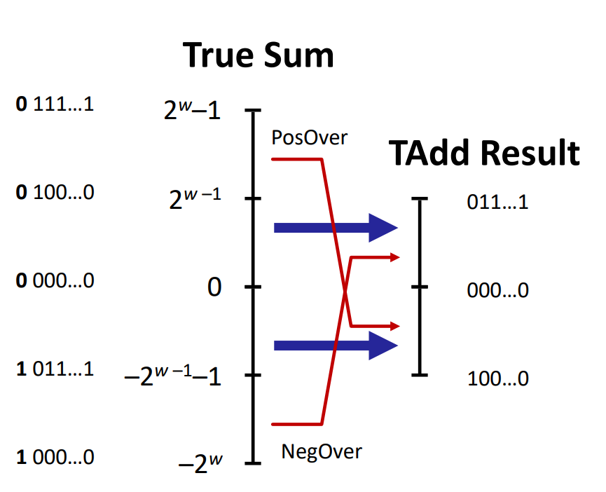

# Bits, Bytes, and Integers

### Bytes = 8 bits
- Binary: 0b00000000
- Hexadecimal: 0x00
- Decimal: 0

### Data Representations

| Signed | Unsigned | 32-bit | 64-bit |
| :----: | :------: | :----: | :----: |
|  char  |   unsigned_char   |  1  | 1 |
|  short  |   unsigned_short   |  2  | 2 |
|  int  |   unsigned   |  4  | 4 |
|  long  |   unsigned_long   |  4  | 8 |
| int32_t | uint32_t | 4 | 4 |
| int64_t | uint64_t | 8 | 8 |
| char* | | 8 | 8 |
| float | | 4 | 4 |
| double | | 8 | 8 |

### Shift Operations
- Left shift: `<<`
    - Shift bit-vector x left y positions
    - Fill with 0's on the right

- Right shift: `>>`
    - Shift bit-vector x right y positions
    - Logical shift (fill with 0's on the left)
    - Arithmetic shift (fill with copies of the sign bit on the left)

- Undefined behavior
    - Shift amount >= width of expression (word size)
    - Negative shift amount (<0)

### Encoding Integers
- Unsigned binary
    - 0b00000000 ~ 0b11111111
    - 0 ~ 255
    - $B2U(X) = \sum_{i=0}^{w-1}x_i2^i$

- Two's complement
    - $B2T(X) = -x_{w-1}2^{w-1} + \sum_{i=0}^{w-2}x_i2^i$

无符号整数使用二进制表示，有符号整数使用补码表示

exp:
```
short int x = 15213
short int y = -15213
```

| | Decimal | Hexadecimal | Binary |
| :----: | :------: | :----: | :----: |
| x | 15213 | 0x3B6D | 0b 0011 1011 0110 1101 |
| y | -15213 | 0xC493 | 0b 1100 0100 1001 0011 |


### Numeric Ranges
- Unsigned
    - $[0, 2^w-1]$
    - $[0, 255]$ (8-bit)
    - $[0, 65535]$ (16-bit)
    - $[0, 4294967295]$ (32-bit)
    - $[0, 18446744073709551615]$ (64-bit)
    - UMin = 0
    - UMax = $2^w-1$

- Two's complement
    - $[-2^{w-1}, 2^{w-1}-1]$
    - $[-128, 127]$ (8-bit)
    - $[-32768, 32767]$ (16-bit)
    - $[-2147483648, 2147483647]$ (32-bit)
    - $[-9223372036854775808, 9223372036854775807]$ (64-bit)
    - TMin = $-2^{w-1}$
    - TMax = $2^{w-1}-1$

- Other Values
    - Minus 1: 111...111 在有符号数中表示-1

| | Decimal | Hexadecimal | Binary |
| :----: | :------: | :----: | :----: |
| UMin | 0 | 0x0000 | 0b 0000 0000 0000 0000 |
| UMax | $2^w-1$ | 0xFFFF | 0b 1111 1111 1111 1111 |
| TMin | $-2^{w-1}$ | 0x8000 | 0b 1000 0000 0000 0000 |
| TMax | $2^{w-1}-1$ | 0x7FFF | 0b 0111 1111 1111 1111 |
| -1 | -1 | 0xFFFF | 0b 1111 1111 1111 1111 |

### Values for Different Word Sizes
- Observations
    - |TMin| = TMax + 1
    - UMax = 2 * TMax + 1

- C Programming
```c++
#include <limits.h>
//Declares constants e.g.
ULONG_MAX = 18446744073709551615
LONG_MIN = -9223372036854775808
LONG_MAX = 9223372036854775807
```

### Mapping between Unsigned and Signed
x --> T2B --> B2U --> y
y --> U2B --> B2T --> x

$T2U(x) = x + 2^w \quad if \quad x < 0$

### Signed vs. Unsigned in C
- Constants
    - Unsigned if have U or u suffix: 0U, 1u, 10U
    - **By default are considered to be signed**

- Casting 
    - Explicit casting between signed and unsigned same as U2T and T2U
    - Implicit casting also occurs via assignment:
        **if there is a mix of signed and unsigned, the signed will be converted to unsigned**

### Sign Extension
- Sign extension
    - Convert a value from a signed type to a wider signed type
    - Copy the sign bit into the new bits
    - **Arithmetic shift right** does sign extension
        e.g. 0b 1001 0111 --> 0b 1111 1111 1001 0111

- Truncation
    - Convert a value from a wider type to a narrower type
    - Discard the high-order bits
    - Casting does truncation
        e.g. 0b 1111 1111 1001 0111 --> 0b 1001 0111

*C automatically performs sign extension when converting from a signed type to a wider signed type*

### Unsigned Addition
- Overflow
    - Unsigned addition can overflow
    - No exception or error
    - Result is truncated to $w$ bits by discarding high-order bits
    - $x + y = (x + y) mod$


### Two's Complement Addition
- Overflow
    - Two's complement addition can overflow
    - No exception or error
    - Result is truncated to $w$ bits by discarding high-order bits
    - $x + y = (x + y) mod 2^w$


补码在计算时仍然满足加法的性质，但是溢出后第二位是0还是1并不确定，所以溢出之后的值正负是不确定的。

### Multiplication
- Unsigned: up to $2w$ bits
    - result range: $[0, {(2^{w}-1)}^2]$
- Two's complement: up to $2w$ bits
    - result range: $[-2^{w-1}*(2^{w-1}-1), {(-2^{w})}^2]$

- Operation
    - u << k == u * $2^k$ both signed and unsigned
    - **Most machines shift and add faster than multiply**
        - Compiler generates this code automatically

### Division
- Operation
    - u >> k == [u / $2^k$] unsigned

### Problems with Unsigned Arithmetic
#### Example 1
```c++
unsigned i;
for (i = cnt-2 ; i>=0 ; i--)
    a[i] += a[i+1];
```
i被定义为unsigned，但在for循环的判断条件中，我们检查i是否大于等于0。由于unsigned类型的整数始终是非负的，这样的判断永远都是真，导致这个循环会无限地执行。

当i达到0并执行i--操作时，i不会变为-1。相反，它会下溢并变成unsigned的最大值（通常是UINT_MAX，例如在32位系统上为4294967295）。接下来的迭代将试图访问a[i]和a[i+1]，这很可能会导致数组越界，并产生不可预测的行为。

正确的写法是，使用$i<cnt$作为循环的终止条件。

#### Example 2
```c++
#define DELTA sizeof(int)
int i;
for (i = CNT ; i-DELTA >= 0 ; i-=DELTA)
    ...
```
sizeof操作返回的类型是size_t，是一个无符号类型，i-DELTA在运算过程中会被转换为无符号类型，即i-DELTA≥0永远为真，导致这个循环会无限地执行。

正确的写法是，使用size_t i而非int i；使用$i<cnt$而非$i-DELTA>=0$作为循环的终止条件。

#### When to Use Unsigned Arithmetic
- Do use when performing modular arithmetic
- Do use when using bits to represent sets

### Byte Ordering
- Big endian
    - Most significant byte at lowest address
    - e.g. 0x01234567
        - 0x01 at lowest address
        - 0x67 at highest address
- Little endian
    - Least significant byte at lowest address
    - e.g. 0x01234567
        - 0x67 at lowest address
        - 0x01 at highest address


Internet Protocol (IP) uses big endian, while Intel uses little endian.

### Representing Strings
- ASCII
    - 7-bit character set
    - 128 characters
    - final bit is always 0
    - byte ordering not an issue **字符串的存储顺序与字节顺序无关**，只有多字节的数据类型才会有字节顺序的问题

