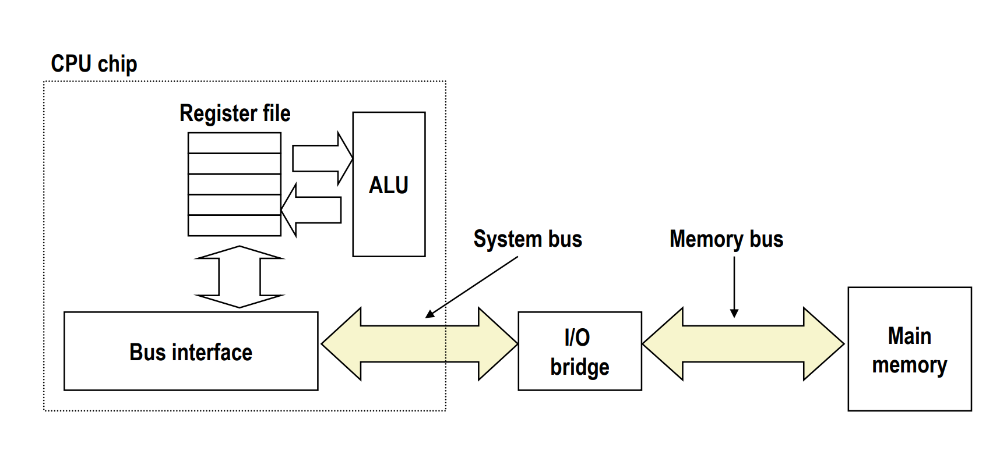
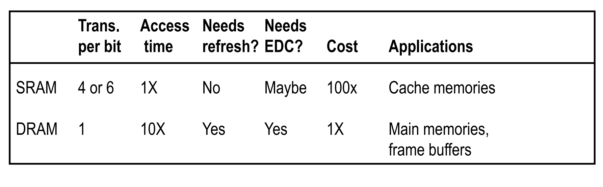
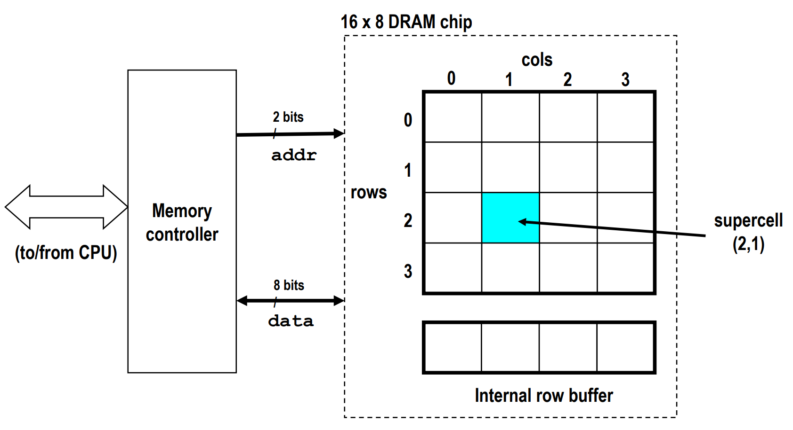
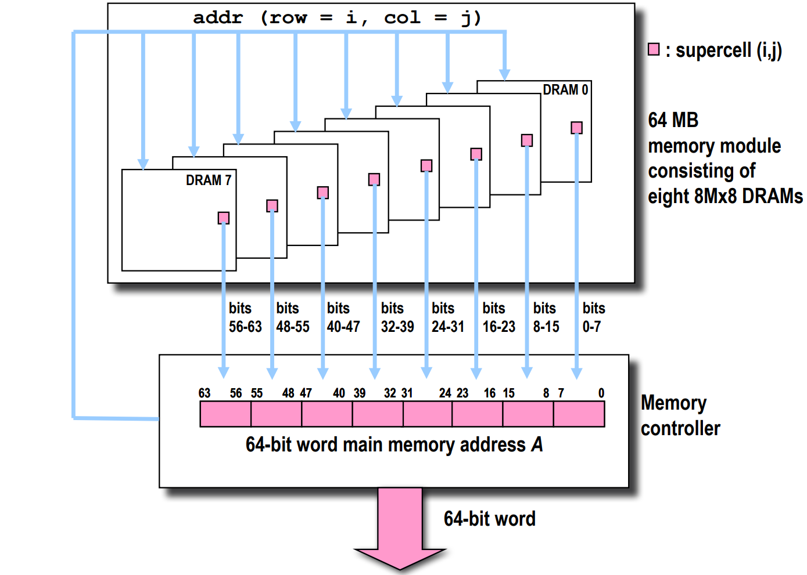
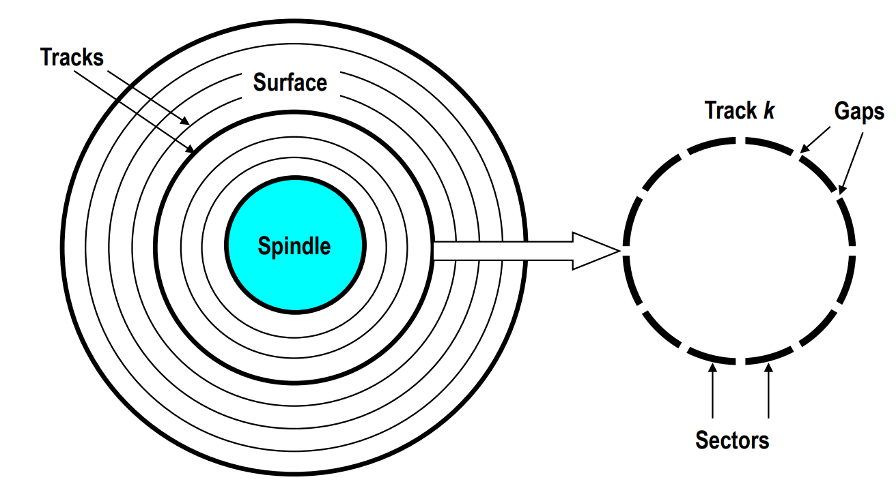
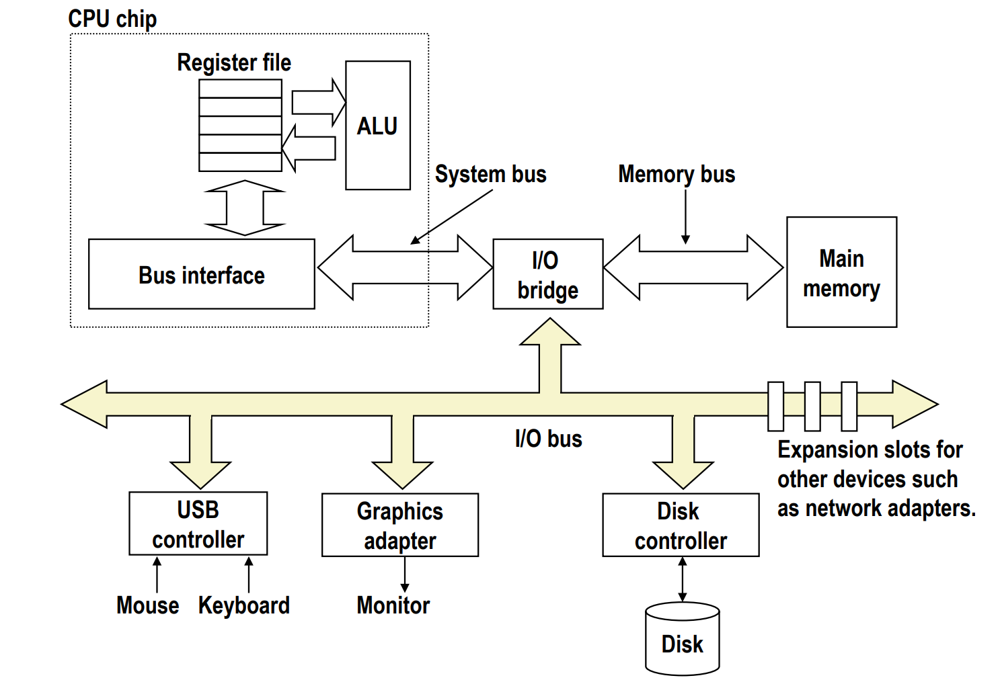
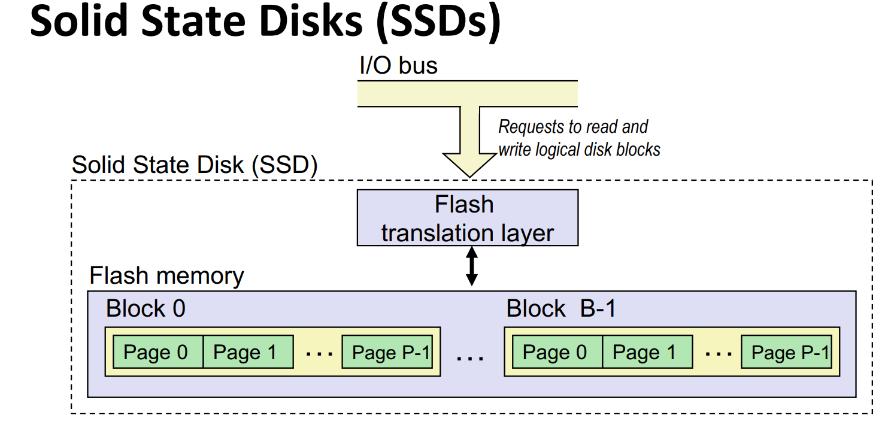

# The Memory Hierarchy

## the memory abstraction
### Traditional Bus Structure Connecting CPU and Memory

- a bus is a collection of wires that carry address, data, and control signals
- buses are typically shared by multiple devices

- Memory read transaction:
    - 1. CPU places address A on memory bus
    - 2. memory reads A from the memory bus, retrieves word x, and places x on the system bus
    - 3. CPU read word x from the bus and copies it into register R

- Memory write transaction:
  - 1. CPU places address A on bus, main memory reads it and waits for the corresponding data word to arrive
  - 2. CPU places data word y on the bus
  - 3. main memory read y from the bus and stores it into memory location A

### Random-Access Memory (RAM)
- key feature
    - RAM is traditionally packaged as a chip
    - basic storeage unit is normally a cell that holds one bit (or a byte)
    - multiple RAM chips form a memory

- RAM comes in two varieties
    - SRAM(static RAM)
    - DRAM(dynamic RAM)

- DRAM
    - 1 transistor + 1 capacitor
    - must refresh state periodically
- SRAM
    - 6 transistors
    - no refresh needed, holds state indefinitely

### Enhanced DRAMs
- basic DRAM cell has not changed since it invention
- DRAM cores with better interface logic and faster I/O
    - Synchronous DRAM (SDRAM)
        - use a conventional clock signal instead of asynchronous control
        - allow reuse of the row addresses
    - Double data-rate synchronous DRAM (DDR SDRAM)
        - transfer data on both the rising and falling edges of the clock signal
        - different types distinguished by the number of bits transferred per clock cycle
            - DDR(2 bits), DDR2(4 bits), DDR3(8 bits), DDR4(16 bits)

### Nonvolatile Memory
- DRAM and SRAM are volatile memory
    - lose their contents if powered off
- Read-only memory(ROM): programming during production
- Progammable ROM(PROM): can be programmed once by the user
- ...

### Conventional DRAM Organization
- dw DRAM
    - d: number of supercell
    - w: number of bits per supercell

### Disk Geometry
- disks consist of platters, each of which has two surfaces
- each surface consists of concentric tracks
- each track is divided into sectors by gaps

- Disk capacity
    - capacity: maximum number of bits that can be stored
        - vendors express capacity in units of gigabytes(GB), where 1GB = 10^9 bytes
    - capacity is determined by these technology factors:
        - recording density
        - track density
        - areal density

- recording zones
    - modern disks partition tracks into disjoint subsets called recording zones

- $$ capacity = \frac{bytes}{sector} \times \frac{sectors}{track} \times \frac{tracks}{surface} \times \frac{surface}{platter} \times \frac{platter}{disk} $$

- reading a disk sector
    - 1. CPU initiates a disk read by writing a command, logical block number, and destination memory address to a port(address) associated with disk controller
    - 2. disk controller read the sector and performs a direct memory access(DMA) transfer into main memory
    - 3. when the DMA transfer completes, the disk controller notifires the CPU with an interrupt(i.e. assert a special interrupt pin on the CPU)

- Solid state disks(SSDs)
    
    - data read/write in units of pages
    - page can be written only after it's block has been erased
    - a block wears out after a certain number(100000) of erase cycles

### SSD Trade-offs vs Rotating Disks
- advantages
    - no moving parts -> faster, less power, more rugged(坚实)
- disadvantages
    - have the potential to wear out    
    - about 2-3 times more expensive per byte
- applications
    - MP3 players, digital cameras, cell phones
    - beginning to appear in desktops and servers

## Locality 局部性
- Principle of Locality
    - programs tend to use data and instructions with addresses near or equal to those they have used recently

- temporal locality: items accessed recently are likely to be accessed again soon
- spatial locality: items with nearby addresses tend to be referenced close together in time

## Cache
- cache is a smaller, faster storage device that acts as a staging area for a subset of the contents of a larger, slower storage device