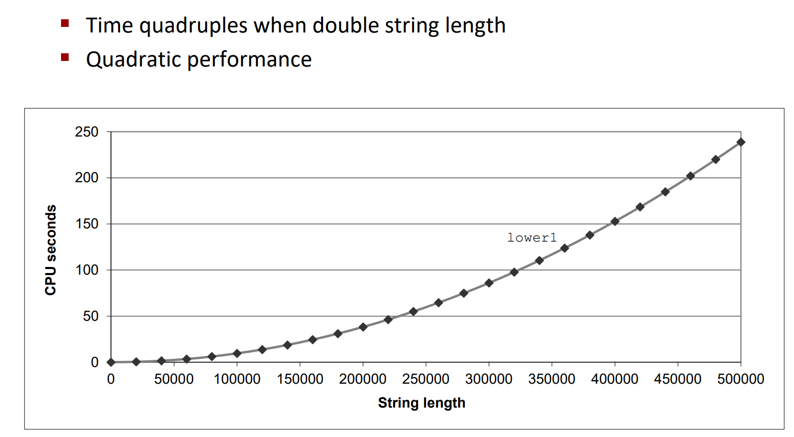

# Lecture 11: Program Optimization

### Performance Realities
- there's more to performance than asymptotic complexity
    - constant factors matter too
        - easily see 10:1 performance range depending on how code is written
        - must optimize at multiple levels
            - algorithmic
            - data representation
            - procedures
            - loops
    - must understand system to optimize performance
        - how programs are compiled and executed   
        - how modern processors + memory systems operate
        - how to measure program performance and identify bottlenecks
        - how to improve performance without destroying code modularity and generality

### Techniques for improving performance
- use better algorithm/data structure
- compile to efficient code
- write source code that the compiler can effectively optimize to efficient executable code
- parallelize your execution

### Optimizing compilers
- provide efficient mapping of program to machine
    - register allocation
    - code selection and ordering
    - dead code elimination
    - eliminating minor inefficiencies
- don't usually improve asymptotic efficiency
    - up to programmer to select best overall algorithm
    - big-O saving are more important than constant factors
    - but constant factors can be important
- have difficulty overcoming optimization blockers
    - potential memory aliasing
    - potential procedure side-effects

## generally useful optimizations
- optimizations that you or the compiler should do regardless of processor/compiler

### code motion
- reduce frequency with which computation performed
```c++
double *a, long n, i, j;
for (j = 0; j < n; j++) {
    a[n*i] = 0;
}
```
- can be improved by moving the computation of n * i out of the loop
```c++
double *a, long n, i, j;
long ni = n * i;
for (j = 0; j < n; j++) {
    a[ni] = 0;
}
```
*循环不变量*

### dead code elimination
```c++
int dead_code(int input){
    if(47 > 0)
        return input;
    else
        return 0;
}
```
- compiler eliminates the dead code
```c++
int dead_code(int input){
    return input;
}
```

### reduction in strength
- replace expensive operations with cheaper ones
```c++
int reduction_in_strength(){
    for(int i=0; i<n; i++){
        int ni = n * i;
        for(j = 0; j < n; j++){
            a[ni+j] = b[j];
        }
    } 
}
```
```c++
int reduction_in_strength(){
    int ni = 0;
    for(int i=0; i<n; i++){
        for(int j=0; j<n; j++){
            a[ni+j] = b[j];
        }
        ni += n;
    }
}
```

### share common subexpressions
- reuse portions of expression
- gcc -O1 will do this
```c++
int share_common_subexpressions(){
    int x = a + b;
    int y = a + b + 1;
    return x + y;
}
```
```c++
int share_common_subexpressions(){
    int x = a + b;
    return x + x + 1;
}
```

### loop elimination
```c++
int loop_while(int a){
    int i = 0;
    while(i < a){
        i++;
    }
    return i;
}
```
```c++
int loop_while(int a){
    return a;
}
```

## optimization blockers
### procedure calls
```c++
int procedure_calls(const char* s){
    for(int i=0; i<strlen(s); i++){
        if(s[i] == 'a'){
            return i;
        }
    }
}
```


- calling strlen
```c++
int strlen(char *s){
    int i = 0;
    while(s[i] != '\0'){
        i++;
    }
    return i;
}
```

- overall performance, string of length N
    - N calls to strlen
    - require time N, N-1, N-2, ..., 1
    - total time is O(N^2)
  
```c++
int procedure_calls(const char* s){
    int len = strlen(s);
    for(int i=0; i<len; i++){
        if(s[i] == 'a'){
            return i;
        }
    }
}
```

- why couldn't compiler move strlen out of inner loop?
    - potential side effects
    - potential aliasing

### memory aliasing
- aliasing: two different names refer to the same memory location

### exploit instruction-level parallelism
- need general understanding of modern processor design
- performance limited by data dependencies
- simple transformations can yield framatic performance improvements

### CPE: cycles per element
- CPE = cycles per OP
- T = CPE * n + Overhead
- Overhead: time to execute loop control, procedure calls, etc.

