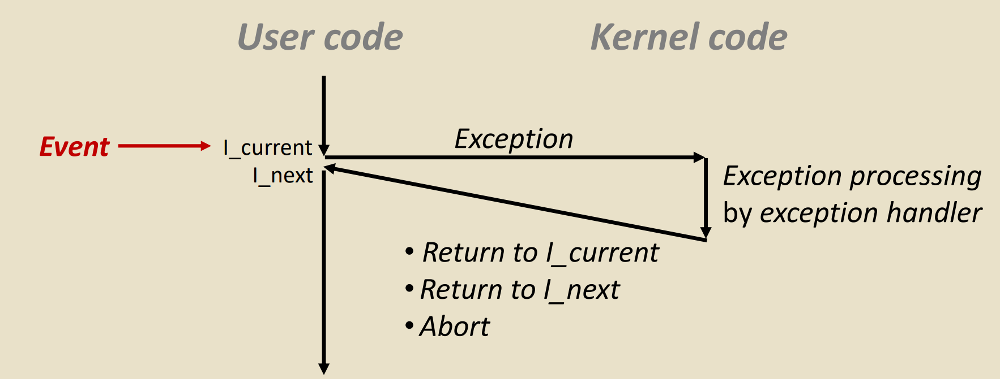
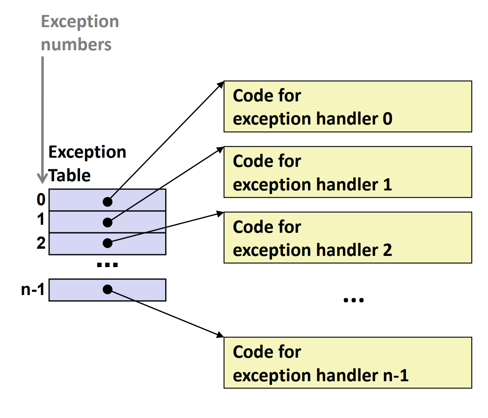
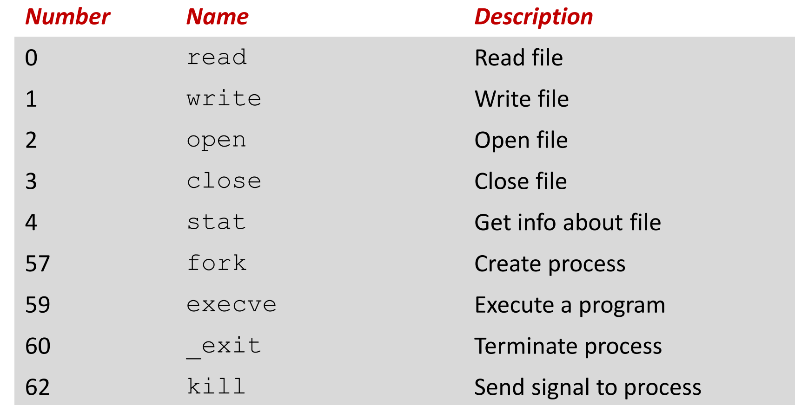
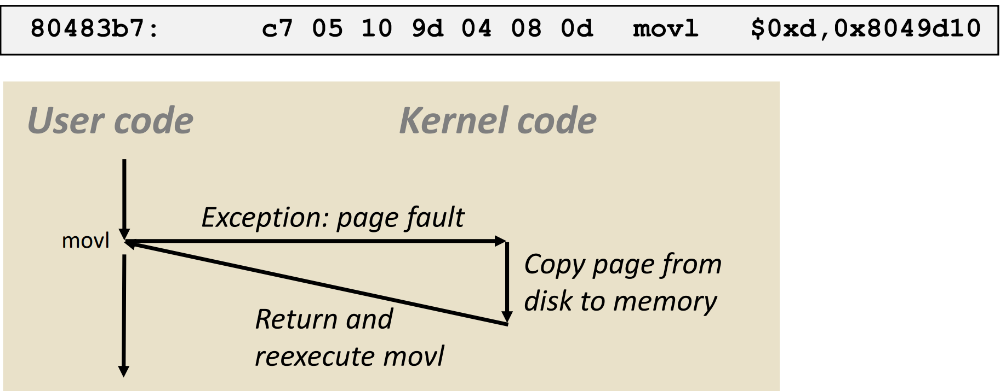
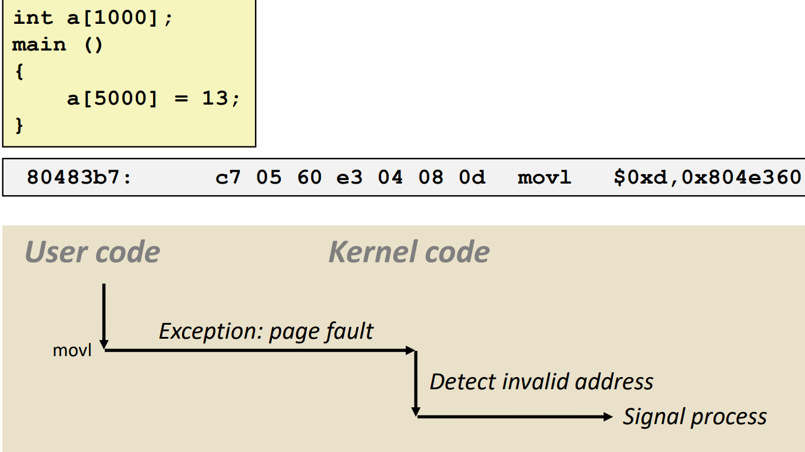
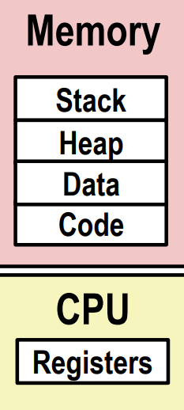
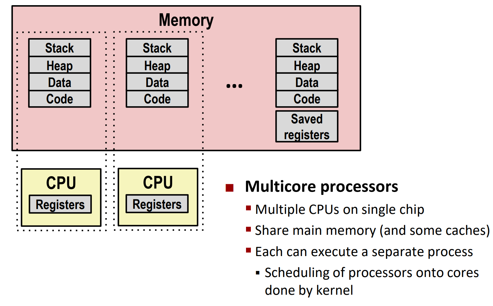
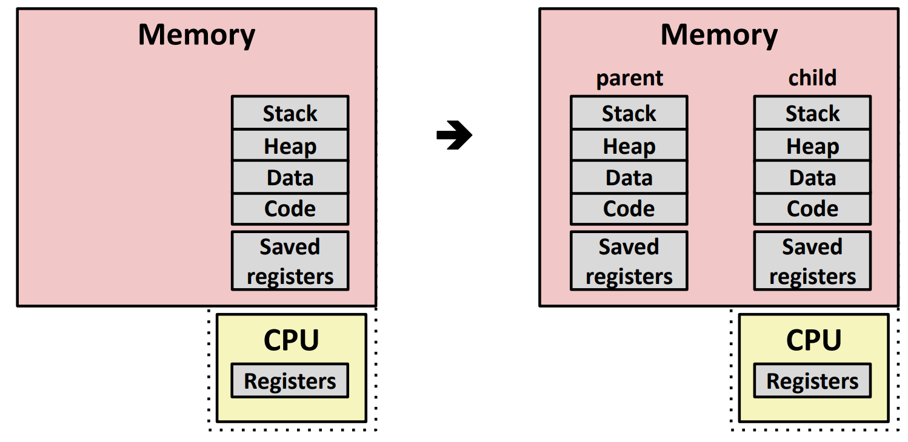
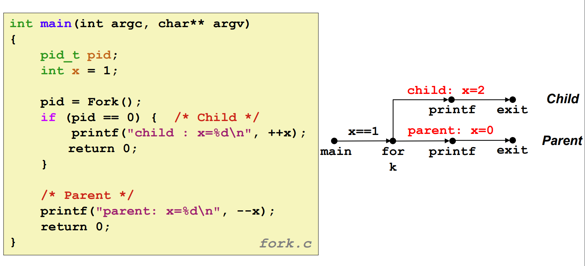

# Exceptional Control Flow: Exceptions and Processes

### Control Flow
- processors do only one thing: fetch and execute instructions
- up to now: two mechanisms for changing control flow
    - procedure calls and returns
    - jumps and branches
- insufficient for a useful system: difficult to react to changes in system state
    - data arrives from a disk or a network adapter
    - instruction divides by zero
    - user hits ctrl-c at the keyboard
    - system timer expires
*上述四种行为都会改变系统控制流的状态：异常控制流*

### Exceptional Control Flow
- exist at all levels of a computer system
- Low level mechanisms
  - exceptions
      - change in control flow in response to a system event
      - implemented using combination of hardware and OS software(硬件发现异常，OS处理异常)
- Higher level mechanisms
    - process context switch
        - implemented by OS software and hardware timer
    - signals
        - software generated exceptions
        - used for interprocess communication
        - implemented by OS software(纯软件)
    - nonlocal jumps
        - implemented by setjmp and longjmp library functions(C runtime library)

### Exceptions
- an exception is a transfer of control to the OS kernel in response to some event(特殊条件下的转移控制流，统一转移到操作系统内核)
    - kernel is the memory-resident portion of the OS
    - examples of event: divide by zero, page fault, system call

- 有三种可能后续执行情况：
    - return to next instruction
    - return to instruction that caused exception
    - abort program

### Exception Tables
- each type of event has a unique number k 
- k=index into exception table
- handler k is called each time exception k occurs


### Asychronous Exceptions 异步异常
- caused bt events external to the processor
    - indicated by setting the processor's interrupt pin
    - handler returns to next instruction
- examples: interrupt **中断**
    - timer interrupt
    - I/O interrupt from external device
        - Ctrl-C from keyboard
        - Arrival of a packet on a network interface
        - Arrival of data from a disk controller

### Synchronous Exceptions 同步异常
- caused by events that occur as a result of executing an instruction:
- traps **陷阱**
    - intentional
    - examples: **system calls**, breakpoint traps, special instructions
    - returns to next instruction
- faults **故障**
    - **unintentional by possibly recoverable**
    - examples: page fault(recoverable), protection fault(unrecoverable), alignment fault
    - eather re-executes faulting current instruction or aborts program
- aborts
    - unintentional and unrecoverable
    - example: parity error, illegal instruction, machine check
    - aborts current program

### system calls
- each x86-64 system call has a unique ID number
- examples:
    

    - user calls: open(filename, options)
    - call __open function, which invokes system call instruction syscall
        ```as
        00000000000e5d70<__open>:
        ...
        e5d79: b8 02 00 00 00 mov $0x2,%eax
        e5d7e: 0f 05 syscall
        e5d80: c3 retq
        ```
        - %rax include system call number
        - %rdi, %rsi, %rdx, %r10, %r8, %r9 contain arguments
        - %rax contains return value
        - Negative value is an error corresponding to negative errno value

- almost like a function call
    - transfer of control to kernel
    - on return, executes next instruction
    - passes arguments using calling conventions
    - get result in %rax
- one important exception:
    - executed by kernel
    - different set of privileges 系统与用户权限不同

### fault example: page fault
- user writes to memory location
- that portion of user's memory is currently on disk(还没有在内存中，比如a[1000]有可能在两页中)

- page handler must load page into physical memory
- returns to faulting instruction
- successful on second try

### fault example: invalid memory reference
- send SIGSEGV signal to process
- user process exits with "segmentation fault" error message
 

## Processes
- a process is an instance of a running 一个正在运行的程序的实例
- process provides each program with two key abstractions:
    - logical control flow
        - each program seems to have exclusive use of the CPU
        - provided by kernel mechanism called context switching
    - private address space
        - each program seems to have exclusive use of main memory
        - provided by kernel machanism called virtual memory
        

### Multiprocessing
- the traditional reality: single processor executes multiple processes concurrently
    - process executions interleaved
    - address spaces managed by virtual memory system
    - register values for nonexecuting processes saved in memory

- the modern reality: multiple processors execute multiple processes concurrently
    - each processor executes a single process
    - address spaces managed by virtual memory system
    - register values for nonexecuting processes saved in memory


- Concurrent Processes
  - each process is a logical control flow
  - two processes run concurrently if their flows overlap in time
  - otherwise, they are sequential

**并发：两个进程的执行时间有重叠，否则是顺序执行**
**并行：两个进程在不同的处理器上执行**

### Context Switching
- processes are managed by a shared chunk of memory resident OS code called the kernal
- 内核不是一个进程，而是一个内存中的代码块，在进程之间共享，作为进程的一部分服务于所有进程
- control flow passes from one process to another via a context switch

## Process Control
### system call error handling
- on error, linux system-level functions typically renturn -1 and set global variable errno to indicate error
- hard and fast rule:
    - you must check the return status of every system-level function
    - only exception is the handful of functions that return void
        ```c
        if((pid = fork()) < 0){
            unix_error("fork error");
        }

        //代码等价于：
        if((pid = fork()) < 0){
            fprintf(stderr, "fork error: %s\n", strerror(errno));
        }
        ```
### error-handling wrappers
- 使用一个包装函数检查进程是否发生错误，并进行错误处理
    ```c
    pid_t Fork(void){
        pid_t pid;

        if((pid = fork()) < 0){
            unix_error("Fork error");
        }
        return pid;
    }
    ```
### creating and terminating processes
- running
    - process is either executing, or waiting to ve executed and will eventually handled by the kernel
- stopped
    - process is suspended and will not be scheduled until further notice
- terminated
    - process is stopped permanently

- creating processes
    - parent process creates a new running child process by calling fork
    - int fork(void)
        - return 0 to the child process, child's PID to the parent, -1 on error
        - child is a copy of the parent's virtual address space
        - child gets identical copy of parent's file descriptors
        - child gets its own copy of parent's open files
        - child has a diffrent PID from parent
- fork calls one but returns two

- **can't predict order of parent and child execution**

- fork problem:
    - linux scheduler does not create much run-to-run variation in the order of parent and child execution
    - solution: Use runtime interpositioning to have program use special version of library code


### wait: synchronizing processes
- int wait(int *child_status)
- parent reaps a child by calling the wait function
- return value is PID of reaped child, or -1 on error

- waitpid: waiting for a specific processes

### execve: loading and running programs
- int execve(const char *filename, char *const argv[], char *const envp[])