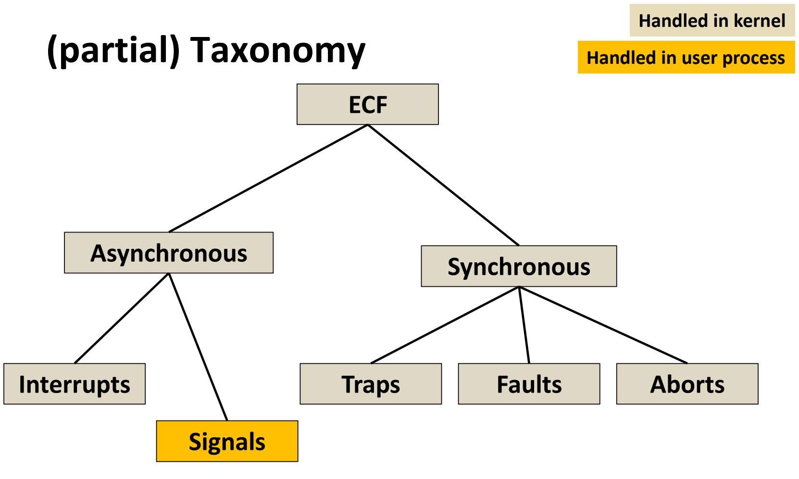

# Exceptional Control Flow: Signals

- signals is handled in user process(用户进程自己处理)
- 将signals定义为异步：不是马上处理

- a signal is a small message that notifies a process that an event of some type has occurred in the system
    - akin to exceptions and interrupts(类似于异常和中断)
    - sent from the kernel to a process(但有些时候是从另一个进程发送的)
    - signal type is identified by small integer ID(1-30)
    - only information in a signal is its ID and the fact that it arrived

- a signal is pending if sent but not yet received
    - there can be at most one pending signal of each type
    - signals are not queued(信号不会排队), subsequent signals of the same type are discarded(后续的信号会被丢弃)
- a process can block the receipt of some signals
- kernel maintains pending and blocked bit vectors in the context of each process(内核在每个进程的上下文中维护了pending和blocked的位向量)

### installing signal handlers
- the signal function modifies the default action associated with the receipt of a signal signum:
    - handler_t *signal(int signum, handler_t *handler)
    - returns: previous handler function pointer
    - different values for handler:
        - SIG_IGN: ignore the signal
        - SIG_DFL: default action   
        - Otherwise, handler is the address of a user-level signal handler function
  