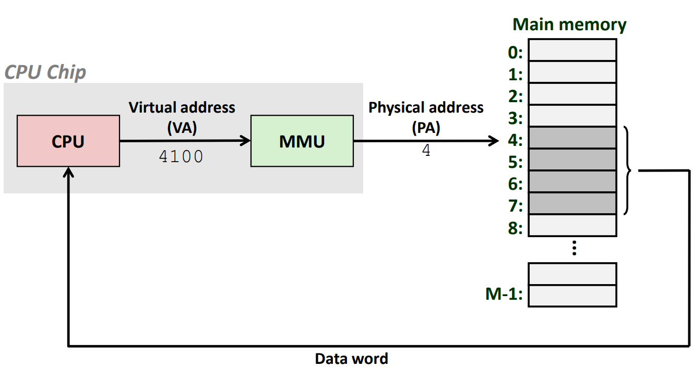

# Virtual Memory

### Solution: add a level of indirection
- each process gets its own private memory space
- addresses all of the previous problems

- add a mapping function to map private addresses to physical addresses
- do the mapping on every load or store
- **this mapping trick is the heart of virtual memory**\

### A system using virtual addressing

- used in all modern servers, laptops, and smart phones

### Address spaces
- linear address space
- virtual address space: 也连续线性，但是地址长度必须是2的整数次幂
- physical address space: 同理，地址长度必须是2的整数次幂

- clean distinction between data(byte) and their attributes(addresses)
- every byte in main memory: one physical address, **one or more virtual addresses**

### Why virtual memory(VM)
- uses main memory efficiently: 多个进程都可以在虚存中
- isolates address spaces
- simplifies memory management: each process gets the same uniform linear address space

### VM as a tool for caching
- VM is an array of N contiguous bytes stored on disk
- the content of the array on disk are cached in physical memory 之前是L1是内存的cache，现在内存是磁盘虚存区域的cache
    - cache blocks are called pages(size is P = $2^p$ bytes)

### Page table
- a page table is an array of page table entries that maps virtual pages to physical pages

