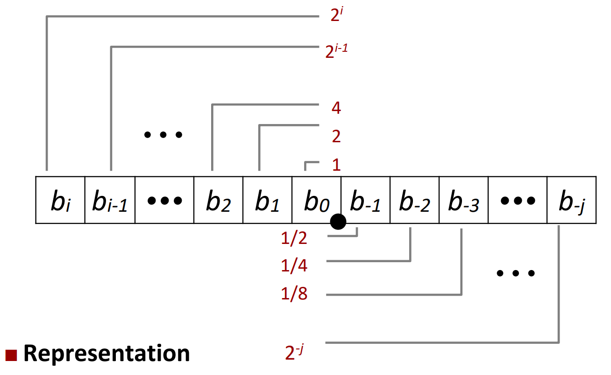
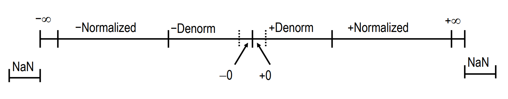
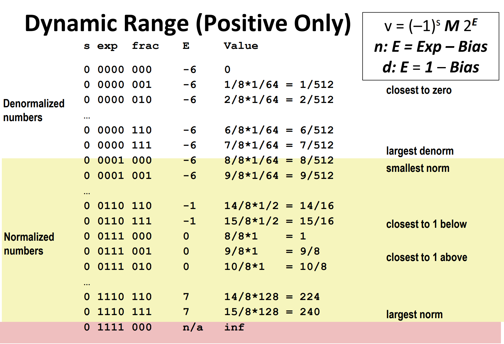

# Floating Point

### Fractional Binary Numbers

- $\Sigma_{k=-j}^{i}x_i2^{k}$

- e.g. $5 \frac{3}{4} = \frac{23}{4}$
- divide by 2 by shifting right

#### Limitation

- can only exactly represent fractions that are sums of negative powers of 2
    - other fractions must be approximated: Patriot Missle Failure
- Just one setting of binary point within the w bits
    - limited range of values

### IEEE Floating Point

| | Sign | Exponent | Fraction |
|---| ---- | -------- | -------- |
| 32bits | 1    | 8        | 23       |
| 64bits | 1    | 11       | 52       |

### Scientific Notation
- e.g. $1.1101101101101_2 * 2^3$
  - significand: $1.1101101101101_2$
  - exponent: $2^3$

### Floating Point Representation
- Numerical value: $(-1)^s * M * 2^E$
    - Sign bit: $s$
    - Exponent bits: $E$
    - Fraction bits: $M$

- Exp:
    - denormalized: $E = 0$ 
    - normalized: $E = 1, ..., 2^k-2$ 
    - special: $E = 2^k-1$  $\rightarrow$ $\infty$ or NaN

### Normalized Values 规格化值
- **Exponent coded as a biased value: E = Exp(e.g.: 10001011) - Bias**
    - Bias = $2^{k-1} - 1$
    - e.g. 8 bits: Bias = 127
    - E range: -126 ~ 127

- **Significand coded with implied leading 1**
    - $M = 1.fraction$
    - $M = 0.fraction$ for denormalized values

- Cases
    - exp = 0...00, frac = 0000...000 $\rightarrow$ $\pm 0$
    - exp = 0...00, frac $\neq$ 0000...000 $\rightarrow$ denormalized value
        Numbers close to 0
    - exp = 1...11, frac = 0000...000 $\rightarrow$ $\pm \infty$
    - exp = 1...11, frac $\neq$ 0000...000 $\rightarrow$ NaN

- denormalized value (values close to 0)
    - $(-1)^s * 0.fraction * 2^{1-Bias}$
    - **attention: E = 1 - bias**

### A Clear Example

### Special Properties of the IEEE Encoding

- Can (Almost) Use Unsigned Integer Comparison
    - must first compare sign bits
    - must consider -0 and +0 to be equal
    - must consider NaNs to be unordered
    - otherwise OK

### Floating Point Operations

- x + y = Round(x + y)
- x * y = Round(x * y)

### Rounding 舍入

| | 1.4 | 1.6 | 1.5 | 2.5 | -1.5 |
| --- | --- | --- | --- | --- | ---- |
towards zero | 1 | 1 | 1 | 2 | -1 |
round down | 1 | 1 | 1 | 2 | -2 |
round up | 2 | 2 | 2 | 3 | -1 |
nearest even | 1 | 2 | 2 | 2 | -2 |

- Closer look at round-to-even
    - all others are statistically biased
    - Applying to other decimal places: 十分位、百分位、千分位、万分位都可以使用向偶数舍入法

### FP Multiplication
- $((-1)^{s1} * M_1 * 2^{E_1}) * ((-1)^{s2} * M_2 * 2^{E_2})$
- exact result:
    - sign s = s1 ^ s2
    - significand M = M1 * M2
    - exponent E = E1 + E2

- fixing:
    - if M >= 2, shift right and increment E
    - if E out of range, overflow
    - round M to fit frac precision

- e.g. $ 1.010 * 2^3 * 1.101 * 2^2 = 1.11101 * 2^5 = 111101 * 2^{-2}$
    - sign: 0
    - significand: 111101
    - exponent: 2

### FP Addition
- $((-1)^{s1} * M_1 * 2^{E_1}) + ((-1)^{s2} * M_2 * 2^{E_2})$ (Assume $E_1 \geq E_2$)
- exact result:
    - align binary points
    - s and M : result of signed align & add
    - exponent E = E1

- fixing:
    - if M >= 2, shift right and increment E
    - if M < 1, shift left and decrement E
    - if E out of range, overflow
    - round M to fit frac precision

- compare to those of Abelian Group
    - not associative: overflow and inexactness of rounding

### Floating Point in C
- Conversions/Casting
    - double/float $\rightarrow$ int
        - Truncates fractional part
        - like rounding toward zero 向零舍入
        - **not defined when out of range or NaN: set to TMin**
    - int $\rightarrow$ float*
        - **maybe round (32 bits > 23 bits)**
    - int $\rightarrow$ double
        - exact

