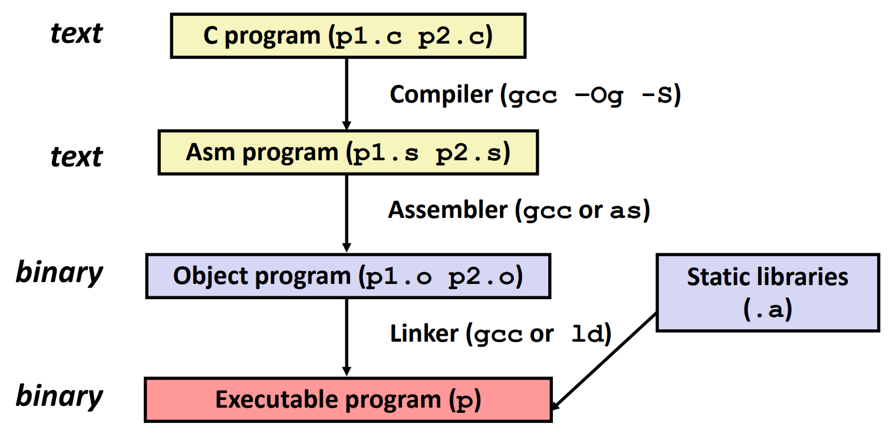
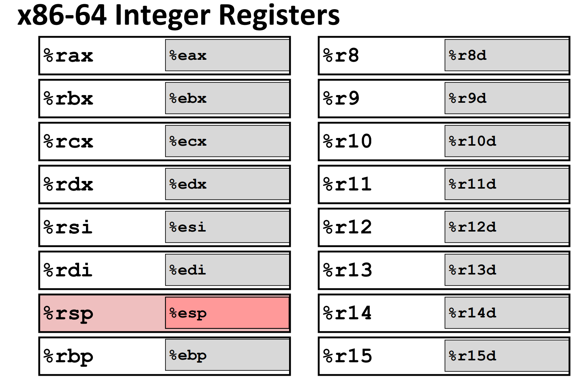
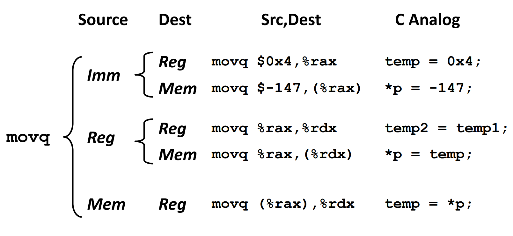

# Machine-Level Programming I: Basics

## C, Assembly, Machine Code
### Definitions
- 指令集架构 Architecture: The parts of a processor design
    - Machine Code: byte level programs that a processor executes
    - Assembly Code: text version of machine code

- 微体系架构 Microarchitecture: The implementation of an architecture
    - C Code: high-level language
    - Compiler: translates C code to assembly code
    - Assembler: translates assembly code to machine code

### Assembly Code View


- PC: Program Counter 程序计数器
    - Address of next instruction
    - Called RIP(x86-64)

- Register file 寄存器
    - Heavily used program data

- Condition codes 条件码
    - store status information about most recent arithmetic or logical operation
    - used for conditional branches
    - e.g. ZF: zero flag, SF: sign flag, OF: overflow flag

- Memory
    - Byte addressable array
    - Code and data

### Turning C into Object Code


- Warning: Will get very different results on server machine due to **different versions of gcc and different compiler settings**

### Assembly Characteristics: Data types
- Integer data of 1, 2, 4, or 8 bytes
    - byte: 8 bits / 1 byte
    - word: 2 bytes
    - long: 4 bytes
    - quad: 8 bytes

- Floating point data of 4, 8, or 10 bytes
    - single: 4 bytes
    - double: 8 bytes
    - long double: 10 bytes

- Code: Byte sequences encoding instructions
    - 1 to 15 bytes long 指令的长度

- No aggregate types: struct, array, union, etc.
    - Only simple scalar types

### Assembly Characteristics: Operations    
- Transfer data between memory and registers
    - load data from memory to register
    - store data from register to memory

- Perform arithmetic function on register or memory data
    - add, sub, mul, div, inc, dec, neg, ...

- Transfer control
    - unconditional jump
    - conditional jump
    - indirect branches

### Object code
- Assembler
    - translates assembly code to machine code
    - binary encoding for each instruction
    - nearly-conplete image of executable code
    - only missing external function addresses (missing links between diffrent object files)

- Linker
    - resolves references between files
    - combines with static library code: e.g. malloc, printf
    - some libraries are dynamically linked

### Diassembling Object Code
```
objdump -d hello.o
```
- useful for debugging

- What can be diassmbled?
    - reverse engineering forbidden by Microsoft End User License Agreement (EULA)

### Registers


- General purpose registers
    - 16 64-bit registers
    - %rax, %rbx, %rcx, %rdx, %rsi, %rdi, %rsp, %rbp, %r8, %r9, %r10, %r11, %r12, %r13, %r14, %r15
    - can be used interchangeably
    - %rsp: stack pointer
    - %rax: return value

### Moving Data
- movq sourse, dest
- operand types
    - immediate 立即数: $0x400, $-533
    - register 寄存器: %rax, %r13
        - **%rsp reserved for special purpose**
    - memory: 8 consecutive bytes at address given by register
        - e.g. (%rsp), 0x400(%rsp), (%rsp, %rbx), 0x400(%rsp, %rbx, 4) **"various"** 
- warning: Intel docs use:
    ```
    mov dest, source
    ```



### Simple Memory Addressing Modes
- Normal: $Mem[Reg[R]]$
    ```
    movq (%rsp), %rax
    ```

- Displacement: $Mem[Reg[R] + D]$
    ```
    movq 8(%rsp), %rax
    ```

- Most general form: $Mem[Reg[R1] + Reg[R2] * Scale + D]$
    ```
    movq 8(%rsp, %rbx, 4), %rax
    ```
    - D: displacement 1, 2, 4 bytes
    - R1: base register
    - R2: index register --> any except %rsp
    - Scale: 1, 2, 4, 8

### Address Computation Instruction 
- leaq source, dest
    - load effective address 加载有效地址
    - dest = &source

- Uses:
    - **computing addresses without a memory reference**
        -e.g. p = &a[i]

    - computing arithmetic expressions of the form x + k * y (k = 1, 2, 4, 8)
        - e.g. 
        ```c++
        long m12(long x){
            return x * 12;
        }
        ```
        ```assembly
        m12:
            leaq (%rdi, %rdi, 2), %rax
            salq $2, %rax
            ret
        ```
        *salq: shift left*

### Some arithmetic and logical operations
- Two Operand Instructions

    | Format | Computation |
    | --- | --- |
    | addq S, D | D = D + S |
    | subq S, D | D = D - S |
    | imulq S, D | D = D * S |
    | salq S, D | D = D << S |
    | sarq S, D | D = D >> S arithmetic |
    | shrq S, D | D = D >> S logical |
    | xorq S, D | D = D ^ S |
    | andq S, D | D = D & S |
    | orq S, D | D = D \| S |

*No distinction between signed and unsigned integers : 位级等价*

- One Operand Instructions

    | Format | Computation |
    | --- | --- |
    | incq D | D = D + 1 |
    | decq D | D = D - 1 |
    | negq D | D = -D |
    | notq D | D = ~D |

*see book for more instructions*