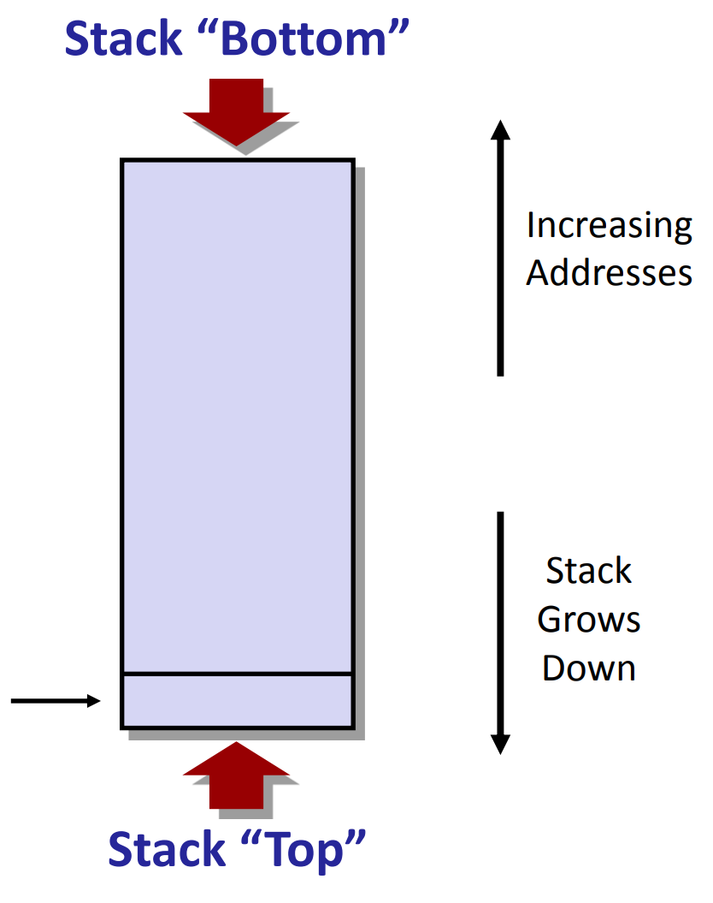
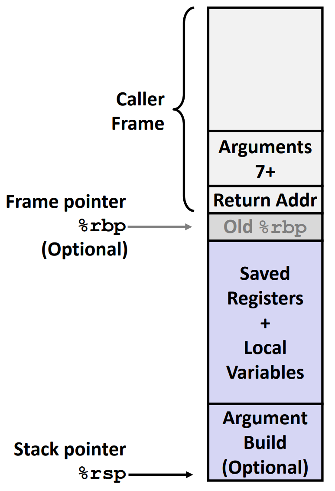

# Machine-Level Programming III: Procedures

## Mechanisms in Procedures
- Passing control
- Passing data
- Memory management

*Mechanisms all inplemented with machine instructions*

*x86-64 inplementation of a procedure uses only those mechanisms required*

e.g.
```c++
long mult2(long, long);
void multstore(long x, long y, long *dest){
    long t = mult2(x, y);
    *dest = t;
}
```
```assembly
multstore:
    pushq %rbx
    call mult2
    movq %rdx, (%rbx)
    popq %rbx
    ret
```
  - Passing control: call, ret
  - Passing data: movq, movabsq
  - Memory management: pushq, popq
  - **Note**: %rbx is callee-saved register
  - **Note**: %rdx is used to return value from mult2
  - **Note**: %rax is used to return value from multstore
  - **Note**: %rdi, %rsi, %rdx are used to pass arguments to mult2
  - **Note**: %rdi is used to pass arguments to multstore
  - **Note**: %rsp is used to allocate space for mult2
  - **Note**: %rsp is used to allocate space for multstore

### x86-64 Stack
- Region of memory managed with stack discipline
    - memory viewed as array of bytes
    - different regions have different purpose
    - grows toward lower addresses
    - %rsp points to top of stack (**lowest address**)
        

### x86-64 Stack: Push & Pop
- pushq src $\equalscolon$ *%rsp $\leftarrow$ src, %rsp $\leftarrow$ %rsp - 8
    - fetch operand
    - **firstly decrement %rsp by 8**: allocate 8 bytes on stack
    - write operand at address (%rsp)

- popq dest $\equalscolon$ dest $\leftarrow$ *%rsp, %rsp $\leftarrow$ %rsp + 8
    - read 8 bytes from address (%rsp)
    - **firstly increment %rsp by 8**: deallocate 8 bytes on stack
    - write bytes to dest(usually a register)

**the memory does not change until, only the value of %rsp changes**

## Passing Control
### Procedure Control Flow
- Use stack to support procedure call and return
- procedure call: **call label**
    - push **return address** on stack: address of the next instruction right after call
    - jump to label
- return address:
    - **address of the next instruction right after call**
- procedure return: **ret**
    - pop return address from stack
    - jump to return address

### Procedure Data Flow
- register first 6 arguments: %rdi, %rsi, %rdx, %rcx, %r8, %r9
- return value: %rax
- stack: other arguments, local variables, return address, saved registers

**only allocate stack space when needed**

## Manage Local Data
### Stack-Based Language
- Languages that support recursion
    - C, C++, Java, Python, Scheme, ML, Haskell, ...
    - Code must be "Reentrant"(可载入：可以被多次同时调用，自身是不会改变的)
        - multiple simultaneous instantiations of single procedure
        - e.g. 随机数发生器就不是reentrant的
    - Need some place to store state of each instantiation
        - local variables
        - return pointer
        - arguments
- Stack discipline
    - state for given procedure needed for limited time(栈上的数据只在有限的时间内有效)
        - from when called to when return
    - callee returns before caller does: 被调用者先返回，调用者后返回
        - callee can overwrite state of caller
        - callee can use same memory for all instantiations
- Stack allocated in **Frames**(栈帧)
    - state for single procedure instantiation: 栈帧是一次实例化时超出寄存器大小时在栈上分配的空间

### Stack Frames
- Contents
    - return information
    - local storage (if needed)
    - temporaries (if needed)
- Management
    - space allocated when enter procedure
        - "set-up" code
        - includes push by call instruction
    - deallocated when return
        - "finish" code
        - includes pop by ret instruction
    

### x86-64/Linux Stack Frame
- Current Stack Frame(从栈顶到栈底/低地址到高地址)
    - argument build: parameters for function about to call
    - local variables: if can't keep in registers
    - saved register context
    - old frame pointer: %rbp

- Caller Stack Frame
    - return address
        - pushed by call instruction
    - arguments for this call

### x86-64/Linux Register Usage
- %rbp: base pointer
    - points to base of current stack frame
    - **%rbp is callee-saved**
- %rsp: stack pointer
    - points to top of current stack frame
    - **%rsp is callee-saved**
- %rbx, %r12, %r13, %r14, %r15: callee-saved
- %rax: return value
    - **caller-saved**
- %rdi, %rsi, %rdx, %rcx, %r8, %r9: first 6 arguments
    - **caller-saved**
- %r10, %r11: **caller-saved**

### Illustration of Recursion
- Handled without special consideration
    - stack frames mean that each function call has private storage
        - save registers & local variables
        - save return address
    - register saving conventions prevent one function call from corrupting another's data
        - unless the C code explicitly does so
    - stack discipline folloews call/return pattern
        - if P calls Q, then Q returns before P does
        - Last-In-First-Out(LIFO) property of stack

- Also works for mutual recursion: P calls Q, Q calls P
    - each call has its own stack frame
    - each call returns to its caller
    - each call has its own set of registers