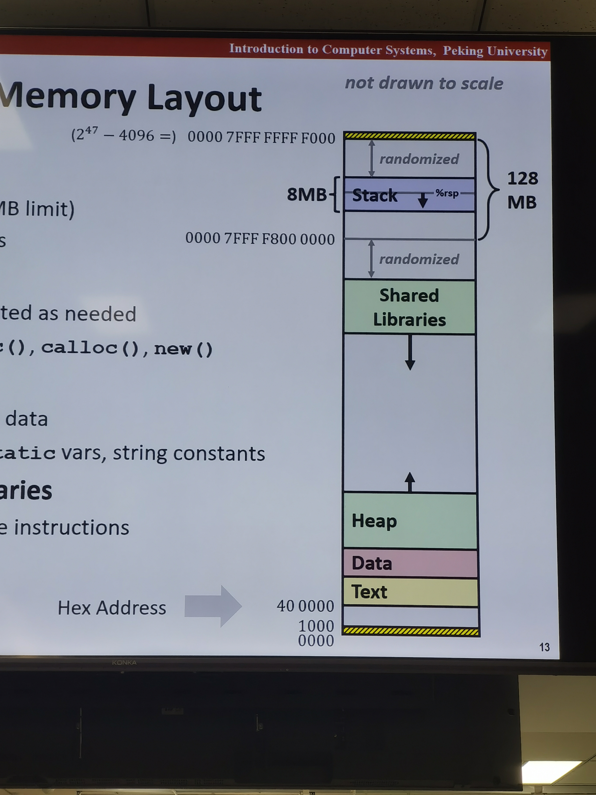

# Machine-Level Programming V: Advanced Topics
## x86-64 Linux Memory Layout
- Stack
    - Runtime stack: 8MB limit
    - e.g. local variables, function parameters, return addresses
- Heap
    - Dynamically allocated memory: 128MB limit
    - e.g. memory allocated by malloc, calloc, new
- Data
    - Global and static data: 8MB limit
    - e.g. global variables, static variables, string constants
- Text/Shared Libraries
    - Executable code: 1GB limit
    - read only

*address range: 0x0000000000000000 - 0x00007fffffffffff = 2^47*

## Runaway Stack Example
- functions store local data in stack frame
- recuresive functions can create many stack frames
- stack frames are limited in size

## Buffer Overflow
### Stack Canaries can help
- idea
    - place special value on stack just beyond buffer
    - check for corruption before exiting function
- GCC implementation
    - -fstack-protector
    - now the default

### System-Level Protection can help
- Noneexecutable stack
    - x86-64 add "execute disable" bit to page table entries
- Randomized stack
    - At start of program, allocate random amount of space on stack
    - Shifts stack addresses for entire program
    - Makes it difficult for hacker to predict beginning of inserted code

### Avoid Overflow Vulnerabilities
- For example, use library routines that limit string lengths
    - use fgets instead of gets
    - use strncpy instead of strcpy

## Return-Oriented Programming Attacks
- Challenge for hackers
    - stack randomization makes it difficult to predict where code will be
    - marking stack nonexecutable prevents hacker from inserting code

- Alternative approach
    - use existing code: library routines, system calls...
    - string together fragments to achieve overall desired outcome
    - does not overcome stack canaries

