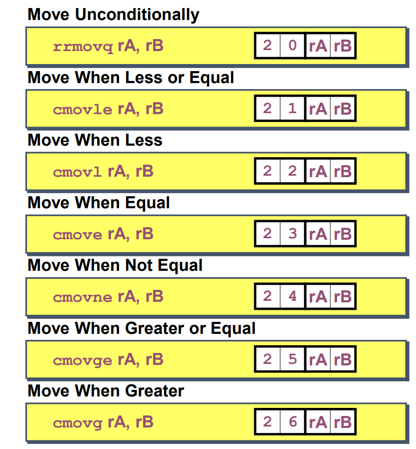

# Processor Architecture I: ISA & Logic Design

## Instruction Set Architecture (ISA)
### Assembly language view
- processor state
    - registers, memory...
- instructions
    - addq, pushq, popq...
    - how instructions are encoded as bytes

### layer of abstraction
- above: how to program machine
    - processor executes instructions in a sequence
- below: what needs to be built
    - use variety of tricks to make it run fast
    - e.g. pipelining, caching, branch prediction...

### Y86-64 Processor State
- program registers
    - 15 registers (not including %r15), each 8 bytes
- condition codes
    - ZF, SF, OF
- program counter
    - indicates address of next instruction
- program status
    - indicate either normal operation or some error condition
- memory
    - byte-addressable storage array
    - words stored in little-endian order

### Y86-64 Instructions
- format
    - 1-10 bytes of information read from memory
        - can determine instruction length from first byte
        - not as many instruction formats as x86-64
    - each access and modify processor state

- encoding registers
    - each register has 4-bit ID (same as x86-64)
    - register ID 0xf indicates "no register"

- addition instruction (算逻运算)
    - addq rA, rB
    - add value in register rA to that in rB
    - store result in rB

- move operations
    - irmovq V, rB
        - move immediate value V into register rB
    - rrmovq rA, rB
        - move value from register rA to rB
    - mrmovq D(rB), rA
        - move value from memory at address D+rB to rA
    - rmmovq rA, D(rB)
        - move value from rA to memory at address D+rB
    - **immediate value store as 8 bytes**

- jump instructions
    -refers to generically as jXX
    - encoding differ only by fn

### Y86-64 Program Stack
- region of memory holding program data
- used in Y86-64 and x86-64 for supporting procedure calls
- stack top indicated by %rsp
- stack grows downward: LIFO

- stack operation
    - pushq rA: A0 rAf(byte order)
    - popq rA: B0 rAf(byte order)

- subroutine call and return
    - call dest: 80 dest(8 bytes)
    - push address of next instruction onto stack
    - start executing instructions at dest

    - ret: 90
    - pop address from stack
    - use ad address for next instruction

### Y86-64 Miscellaneous Instructions
- halt: 00
    - stop executing instructions
    - x86-64 has comparable instruction, but can't execute it in user mode
    - use it to stop the simulator
    - encoding ensures that program hitting memory initialized to 0 will halt
- nop: 10
    - no operation
    - x86-64 has comparable instruction
    - useful for padding

### status conditions
- if AOK, continue executing instructions
- otherwise, stop executing instructions
  - AOK = code 1: normal operation
  - HLT = code 2: halt instruction encountered
  - ADR = code 3: invalid memory address
  - INS = code 4: invalid instruction

### Writing Y86-64 code
- try to use c compiler as much as possible
    - compile for x86-64 with gcc -Og -S
    - transliterate into Y86-64

### CISC instruction set
- complex instruction set computer
- IA32 is CISC
- stack-oriented instruction set
    - use stack to pass arguments, save program counter
    - explicit push and pop instructions
- arithmetic instructions can access memory
    - e.g. addl (%eax), %ebx
    - requires memory read and write
    - complex address calculation
- condition codes
    - set as side effect of arithmetic and logical instructions
- philosophy
    - add instructions to perform "typical" programming tasks

### RISC instruction set
- reduced instruction set computer
- IBM 801 is RISC
- fewer, simpler instructions
    - might take more to get given task done
    - can execute them with small and fast hardware
- register-oriented instruction set
    - many more registers than CISC (typically 32)
    - use for arguments, return pointer, temporaries
- only load and store instructions can access memory
    - similar to Y86-64 mrmovq and rmmovq
- no conditional code
- philosophy
    - make common case fast
    - keep it simple

### CISC vs. RISC
- CISC proponents -- easy for compiler, fewer instructions
- RISC proponents -- run fast with simple chip design, better for optimizing compiler
- current status
    - x86-64 is CISC, but adopted many RISC features
    - for embedded processors, RISC make sense
        - smaller, cheaper, less power
        - most cell phones use ARM processor
- for desktop processors, choice of ISA not a technical issue