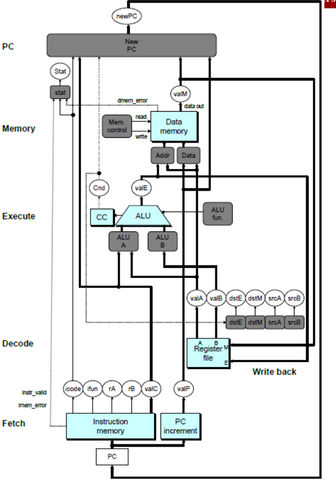
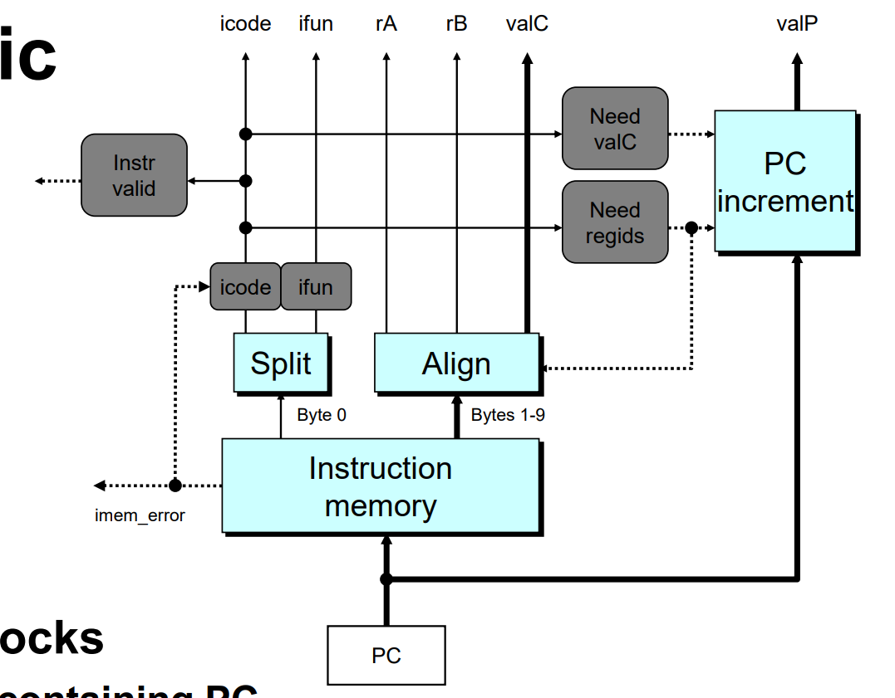
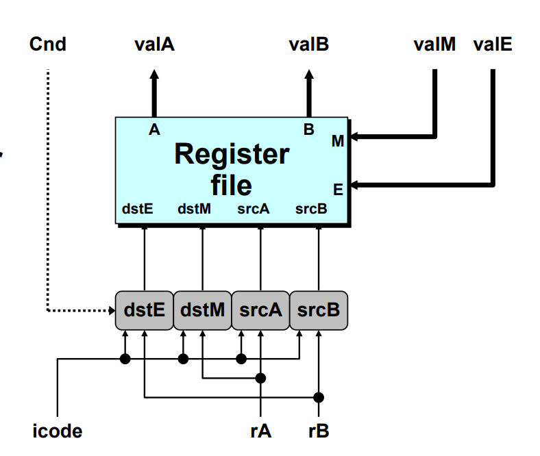
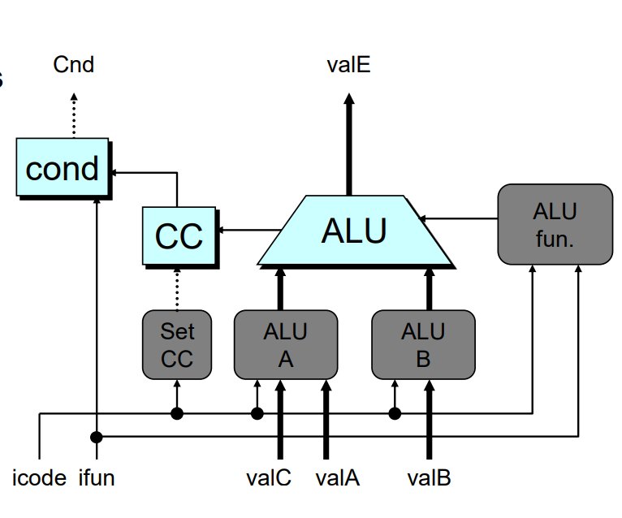
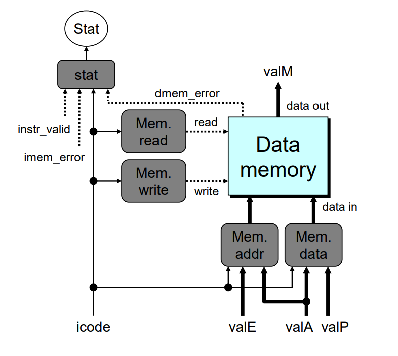
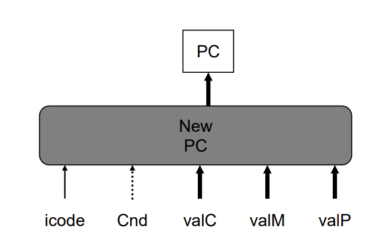

# Processor Architecture II: Arch-Sequential
## SEQ Stages
- Fetch
    - get instruction from memory
- Decode
    - read program registers
- Execute
    - compute value or address
- Memory
    - read or write data
- Write Back
    - write result into register
- PC Update
    - update program counter

### Stage Computation: Cond. Move
| | cmov rA, rB |
|---|---|
| Fetch | icode:ifun <- M1[PC]<br/> rA:rB <- M1[PC+1] <br/> valP <- PC+2 |
| Decode | valA <- R[rA] <br/> valB <- R[rB] |
| Execute | valE <- valB <br/> **if !Cond(CC, ifun) rB <- 0xf** |
| Memory | |
| Write Back | R[rB] <- valE |
| PC Update | PC <- valP |

- cancel move by setting destination register to 0xf

### Stage Computation: Indirect Jump
| | jXX Dest |
|---|---|
| Fetch | icode:ifun <- M1[PC]<br/> valC <- M8[PC+1] <br/> valP <- PC+9 |
| Decode | |
| Execute | Cnd <- Cond(CC,ifun) |
| Memory | |
| Write Back | |
| PC Update | PC <- Cnd ? valC : valP |

- compute both addresses
- choose based on setting of condition codes and branch condition

### Stage Computation: call
| | call Dest |
|---|---|
| Fetch | icode:ifun <- M1[PC]<br/> valC <- M8[PC+1] <br/> valP <- PC+9 |
| Decode | valB <- R[%rsp] |
| Execute | valE <- valB + (-8) |
| Memory | M8[valE] <- valP |
| Write Back | R[%rsp] <- valE |
| PC Update | PC <- valC |

### Stage Computation: return
| | ret |
|---|---|
| Fetch | icode:ifun <- M1[PC]<br/> valP <- PC+1 |
| Decode | valA <- R[%rsp] <br/> valB <- R[%rsp] |
| Execute | valE <- valB + 8 |
| Memory | valM <- M8[valA] |
| Write Back | R[%rsp] <- valE |
| PC Update | PC <- valA |

### Computed Values
- Fetch
    - icode: instruction code
    - ifun: instruction function
    - rA: register A
    - rB: register B
    - valC: instruction constant
    - valP: incremented program counter
- Decode
    - valA: value from register A
    - valB: value from register B
    - srcA: source register A
    - srcB: source register B
    - destE: destination register E
    - destM: destination register M
- Execute
    - valE: ALU result
    - Cnd: condition code status
- Memory
    - valM: memory read value

## SEQ Hardware

- blue boxes: predesigned hardware
    - e.g. memories, ALU, registers
- gray boxes: control logic
    - e.g. describe in HCL
- white ovals: label for signals
- thick lines: 64-bit word values
- thin lines: 4-8 bit values
- dotted lines: 1-bit values

### Fetch logic

- Instr valid: is this function valid?
- icode, ifun: generate no-op if invalid
- need regids: does this instruction have a register byte?
- need valC: does this instruction have a constant word?

### Decode Logic

- register file
    - read ports A,B
    - write port E,M
- control logic
    - srcA, srcB: read port addresses
    - destE, destM: write port addresses
- signals
    - cnd: indicate whether or not to perform conditional move (compute in execute stage)

### Execute Logic

- ALU
    - implements 4 requeired functions
    - computes condition codes
- CC
    - register with 3 condition code bits
- cond
    - compute conditional jump/move flag
- control logic
    - ALU A: input A to ALU
    - ALU B: input B to ALU
    - ALU fun: what function should ALU compute
        - 很多时候可以设置为加法，只有面对OP时才需要设置为其他

### Memory Logic

- memory
    - read/write memory word
- control logic
    - stat: what is instruction status
    - Mem. read: should word be read?
    - Mem. write: should word be written?
    - Mem. addr: select memory address
    - Mem. data: select memory input data

```hcl
int stat = [
    imem_error || dmem_error: SADR;
    !instr_valid: SINS;
    icode == I_HALT: SHLT;
    1: SAOK;
]
```
### PC Update Logic

- new PC: select next value of PC

### SEQ Operation
- State
    - PC register
    - Cond. code register
    - data memory
    - register file
    **all update as clock rises**
- combinational logic
    - ALU
    - control logic
    - memory reads
        - instruction memory
        - register file
        - data memory